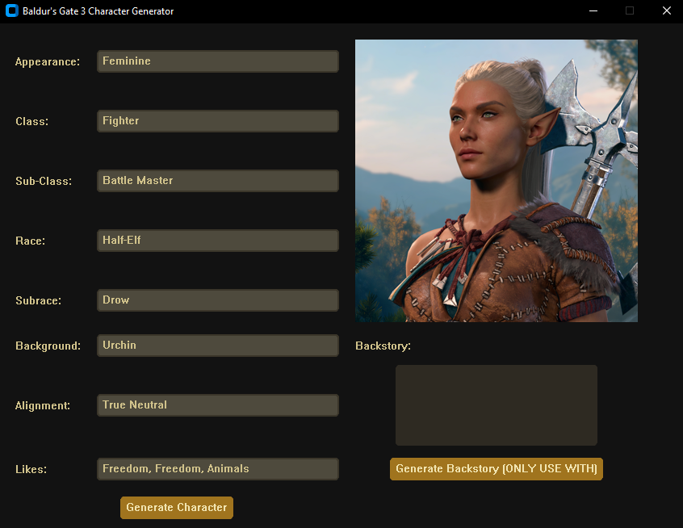

# Baldur's Gate 3 Character Generator

## Overview
This is an early alpha version of a **Baldur's Gate 3 Character Generator**. The generator creates fully randomized characters, including:
- Race
- Class
- Background
- Personality Traits
- Likes
- Appearance Details

Additionally, the program includes a feature to generate a backstory using a local **LLM**. However, users must manually set up **Ollama**(https://ollama.com/) to enable this functionality.

## Screenshot


## Features
✅ Fully random character generation (Race, Class, Background, Traits, etc.)  
✅ Local LLM integration for backstory generation (requires user setup)  
✅ Windows installer and executable for easy setup  
🚧 **Planned Features:** UI improvements, customization options, and save/export functionality, images for each class/appearance combination, dieties for clerics, and early game playstyle choices like fighter fighting style, barbian bestial hearts, etc.

## Requirements
- **Python 3.x** (for manual setup)
- **Ollama** (for backstory generation, optional)
- **Llama 3.2:latest** model (if using backstory generation)

## Setup & Installation
### Option 1: Windows Installer (Recommended for Regular Users)
1. Download the latest **installer (.exe)** from the [Releases](https://github.com/cmillion3/Baldur-sGate3CharacterGen/releases/tag/0.1) page.
2. Run the installer and follow the instructions.
3. Launch the program from the Start Menu or Desktop shortcut.

### Option 2: Manual Setup (For Developers & Advanced Users)
1. Clone the repository:
   ```sh
   git clone https://github.com/yourusername/bg3-character-generator.git
   cd bg3-character-generator
   ```
~~2. Install dependencies:~~ 
There is no requirements.txt right now, just pip install customtkinter, ollama, and pillow
   ```sh
   pip install -r requirements.txt
   ```
3. (Optional) Set up **Ollama** for backstory generation:
   - Install Ollama: [https://ollama.ai/](https://ollama.ai/)
   - Download the model:
     ```sh
     ollama pull llama3:latest
     ```
   - Ensure Ollama is running before launching the generator!

## Usage
### Windows Users (Using the Installed Version)
Simply run the application from the Start Menu or Desktop shortcut.

### Manual Run (Python Script)
Run the generator using:
```sh
python main.py
```
If Ollama is set up, the program will attempt to generate a backstory.

## Contributions
Since this project is in early development, feedback and contributions are welcome! Feel free to submit issues and pull requests.

## License
This project is licensed under the MIT License. See `LICENSE` for details.

